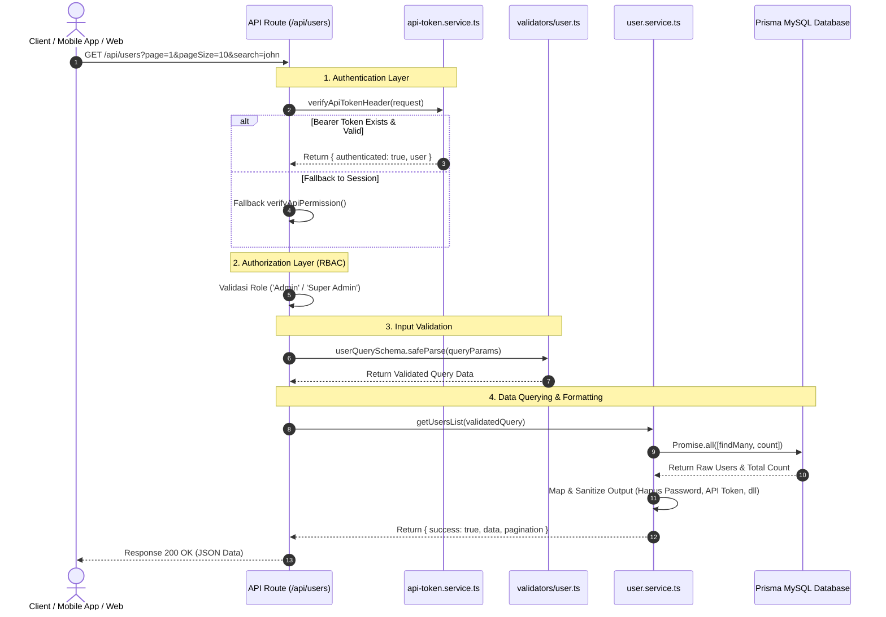

# Documentation: Workflow & Architecture API `/api/users`

Dokumen ini berisi penjelasan detailmengenai alur kerja (*workflow*), arsitektur, file-file yang terlibat, dan potongan kode beserta fungsinya pada endpoint **`GET /api/users`**.

---

## 📐 Arsitektur & Alur Kerja Utama (Workflow)



---

## 🗂️ Detail File, Kode, dan Fungsi Komponen

### 1. API Route Handler (Controller Layer)
📄 **File:** `src/app/api/users/route.ts`

File ini bertindak sebagai pintu masuk utama (*endpoint*) HTTP `GET /api/users`.

```typescript
import { NextResponse } from 'next/server';
import { userQuerySchema } from '@/validators/user';
import { getUsersList } from '@/services/user/user.service';
import { verifyApiTokenHeader } from '@/services/user/api-token.service';
import { verifyApiPermission } from '@/lib/apiHelper';

export const dynamic = 'force-dynamic';

export async function GET(request: Request) {
  let currentUserRole = '';
  let isAuthenticated = false;

  // 1. Dual Authentication (Bearer Token & Session Fallback)
  const tokenAuth = await verifyApiTokenHeader(request);
  if (tokenAuth.authenticated && tokenAuth.user) {
    isAuthenticated = true;
    currentUserRole = tokenAuth.user.role || '';
  } else {
    const sessionAuth = await verifyApiPermission(request, 'User Management', 'View');
    if (sessionAuth.authorized && sessionAuth.userId) {
      isAuthenticated = true;
      currentUserRole = 'Admin';
    }
  }

  if (!isAuthenticated) {
    return NextResponse.json({ success: false, message: 'Unauthorized' }, { status: 401 });
  }

  // 2. Authorization RBAC Check
  const normalizedRole = currentUserRole.toLowerCase();
  const isAuthorizedRole =
    normalizedRole.includes('admin') ||
    normalizedRole.includes('super admin') ||
    normalizedRole.includes('superadmin');

  if (!isAuthorizedRole) {
    return NextResponse.json({ success: false, message: 'Forbidden' }, { status: 403 });
  }

  // 3. Input Query Parsing & Zod Validation
  try {
    const { searchParams } = new URL(request.url);
    const queryParams = {
      page: searchParams.get('page') || undefined,
      pageSize: searchParams.get('pageSize') || undefined,
      search: searchParams.get('search') || undefined,
      sort: searchParams.get('sort') || undefined,
      order: searchParams.get('order') || undefined,
    };

    const parseResult = userQuerySchema.safeParse(queryParams);
    if (!parseResult.success) {
      return NextResponse.json(
        { success: false, message: 'Validation Error', errors: parseResult.error.flatten().fieldErrors },
        { status: 400 }
      );
    }

    // 4. Panggil Business Logic Service
    const result = await getUsersList(parseResult.data);
    return NextResponse.json(result, { status: 200 });
  } catch (error) {
    return NextResponse.json({ success: false, message: 'Internal Server Error' }, { status: 500 });
  }
}
```

#### 🔍 Detail Fungsi:
- **Dual Authentication**: Mendukung akses via `Authorization: Bearer <ptm_token>` (untuk API/Mobile) dan NextAuth Session Cookie (untuk Web Dashboard).
- **RBAC Check**: Memastikan pengguna yang mengakses memiliki *role* `Admin` atau `Super Admin`.
- **Query Extraction & Validation**: Mengambil parameter URL (`page`, `pageSize`, `search`, `sort`, `order`) dan memvalidasinya menggunakan Zod.

---

### 2. Input Validation Layer (Zod Schema)
📄 **File:** `src/validators/user.ts`

File ini memastikan parameter pencarian, halaman, dan pengurutan (*sorting*) aman dan sesuai standar tipe data.

```typescript
import { z } from 'zod';

export const userQuerySchema = z.object({
  page: z.coerce.number().int().min(1).default(1),
  pageSize: z.coerce.number().int().min(1).max(100).default(20),
  search: z.string().optional(),
  sort: z.enum(['username', 'fullName', 'email', 'createdAt']).default('createdAt'),
  order: z.enum(['asc', 'desc']).default('desc'),
});

export type UserQueryInput = z.infer<typeof userQuerySchema>;
```

#### 🔍 Detail Fungsi:
- **`z.coerce.number()`**: Mengonversi otomatis parameter string dari URL (seperti `"1"`) menjadi tipe `number`.
- **Default Values**: Memberikan default `page = 1`, `pageSize = 20`, `sort = createdAt`, dan `order = desc`.
- **Safety Limits**: Batas `pageSize` maksimal 100 untuk mencegah beban *query* berlebih pada database.

---

### 3. Business Logic & Query Service Layer
📄 **File:** `src/services/user/user.service.ts`

File ini bertanggung jawab langsung dalam melakukan pencarian ke database (via Prisma) dan memformat respons JSON.

```typescript
import { prisma } from '@/lib/prisma';
import { UserQueryInput } from '@/validators/user';

export async function getUsersList(query: UserQueryInput): Promise<UserListResponse> {
  const { page, pageSize, search, sort, order } = query;
  const skip = (page - 1) * pageSize;

  const whereClause: Record<string, unknown> = {};

  // Fitur Filter Search
  if (search && search.trim() !== '') {
    const searchFilter = search.trim();
    whereClause.OR = [
      { username: { contains: searchFilter } },
      { name: { contains: searchFilter } },
      { email: { contains: searchFilter } },
    ];
  }

  let sortField = sort as string;
  if (sortField === 'fullName') {
    sortField = 'name';
  }

  // Menjalankan Query Data & Count secara Paralel
  const [users, totalData] = await Promise.all([
    prisma.user.findMany({
      where: whereClause,
      select: {
        id: true,
        username: true,
        name: true,
        email: true,
        image: true,
        role: true,
        status: true,
        createdAt: true,
      },
      orderBy: { [sortField]: order },
      skip,
      take: pageSize,
    }),
    prisma.user.count({ where: whereClause }),
  ]);

  // Mapping Output Data (Sanitasi Data Sensitif)
  const formattedUsers: UserResponseItem[] = users.map((u) => ({
    id: u.id,
    username: u.username,
    fullName: u.name,
    email: u.email,
    avatar: u.image,
    role: u.role,
    status: u.status,
  }));

  return {
    success: true,
    data: formattedUsers,
    pagination: {
      page,
      pageSize,
      totalData,
      totalPages: Math.ceil(totalData / pageSize),
    },
  };
}
```

#### 🔍 Detail Fungsi:
- **`Promise.all()`**: Mengeksekusi pencarian data (`findMany`) dan perhitungan total data (`count`) secara bersamaan untuk mempercepat waktu eksekusi.
- **Data Sanitization**: Hanya mengambil kolom publik (`id`, `name`, `username`, `email`, `role`, `status`) dan menyembunyikan kolom sensitif seperti `password` dan `apiToken`.
- **Pagination Calculation**: Menghitung `totalPages` secara otomatis (`Math.ceil(totalData / pageSize)`).

---

### 4. Authentication Service Layer (Personal API Token)
📄 **File:** `src/services/user/api-token.service.ts`

File ini bertugas memverifikasi kecocokan **Personal API Token** (`ptm_...`) yang dikirim di header `Authorization`.

```typescript
export async function verifyApiTokenHeader(request: Request): Promise<UserTokenAuthResult> {
  const authHeader = request.headers.get('authorization') || request.headers.get('Authorization');
  if (!authHeader || !authHeader.startsWith('Bearer ')) {
    return { authenticated: false, ipAddress, userAgent };
  }

  const rawToken = authHeader.substring(7).trim();
  if (!rawToken || !rawToken.startsWith('ptm_')) {
    return { authenticated: false, ipAddress, userAgent };
  }

  // Hash token mentah menggunakan SHA-256 untuk dicocokkan ke database
  const tokenHash = hashApiToken(rawToken);

  const user = await prisma.user.findFirst({
    where: { apiToken: tokenHash },
    select: { id: true, name: true, username: true, email: true, role: true, status: true },
  });

  if (!user || user.status !== 'ACTIVE') {
    return { authenticated: false, ipAddress, userAgent };
  }

  return { authenticated: true, user, ipAddress, userAgent };
}
```

#### 🔍 Detail Fungsi:
- Membaca header `Authorization: Bearer ptm_...`.
- Melakukan hashing SHA-256 pada token yang diterima.
- Mencari user aktif (`ACTIVE`) di database yang memiliki hash `apiToken` yang sesuai.

---

## 📊 Ringkasan Struktur File & Fungsinya

| File | Peran | Deskripsi Singkat |
| :--- | :--- | :--- |
| `src/app/api/users/route.ts` | **Controller** | Menerima HTTP Request, menangani Autentikasi/Otorisasi, memanggil validator, dan mengembalikan HTTP Response. |
| `src/validators/user.ts` | **Validator** | Memvalidasi parameter query (`page`, `pageSize`, `search`, `sort`, `order`). |
| `src/services/user/user.service.ts` | **Service** | Berhubungan langsung dengan database Prisma untuk pencarian user, pagination, dan sanitasi data. |
| `src/services/user/api-token.service.ts` | **Security** | Verifikasi token `Bearer ptm_...` menggunakan hashing SHA-256. |
