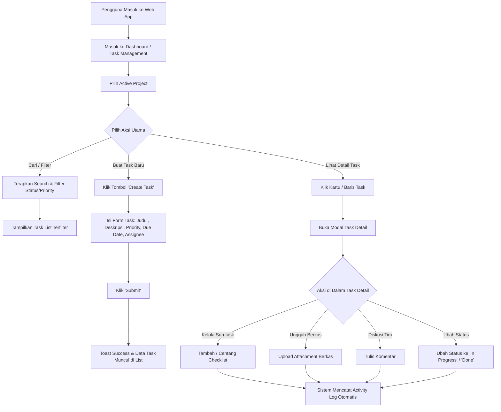
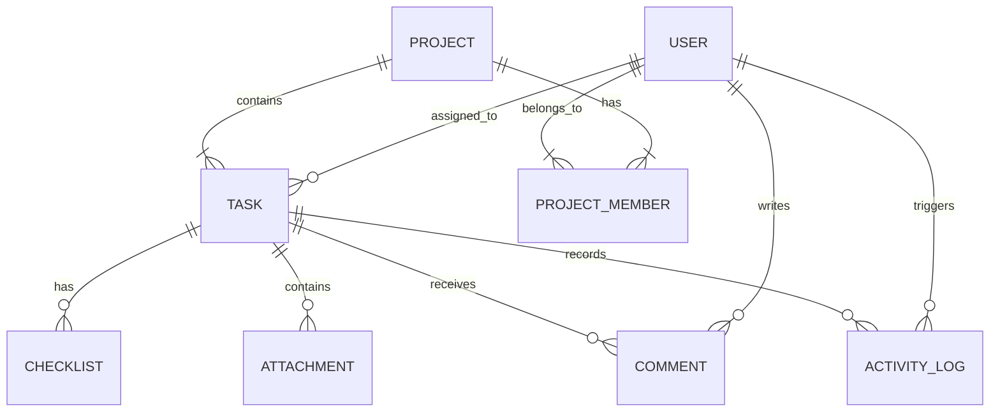

# 📄 Product Requirements Document (PRD)
## Web Task Management Module — Enterprise Web Application

---

## 1. Document Information

| Attribute | Details |
| :--- | :--- |
| **Document Title** | Product Requirements Document (PRD) — Web Task Management Module |
| **Document Owner / Author** | Product Management & Engineering Team |
| **Version** | 2.0.0 (Web Edition) |
| **Date** | 2 Agustus 2026 |
| **Status** | Approved for Production & Documentation |
| **Target Audience** | Software Engineers, QA Testers, UI/UX Designers, Product Managers, Stakeholders |

---

## 2. Overview

Fitur **Task Management** adalah modul utama dari platform manajemen proyek berbasis Web yang dirancang untuk membantu tim mengorganisir, memantau, mendokumentasikan, dan menyelesaikan pekerjaan secara kolaboratif dan terstruktur.

### Masalah yang Diselesaikan
* **Pekerjaan Terfragmentasi**: Kurangnya transparansi status dan kepemilikan tugas (*task ownership*) dalam proyek tim.
* **Komunikasi Terpisah**: Diskusi, berkas lampiran, dan instruksi tugas sering kali tersebar di saluran komunikasi eksternal.
* **Sulitnya Tracking Progress**: Manajemen proyek tidak memiliki transparansi atas kemajuan pekerjaan dan tenggat waktu (*due dates*).

### Manfaat bagi Pengguna
* **Single Source of Truth**: Seluruh instruksi, berkas, daftar periksa, dan diskusi terpusat dalam satu kartu tugas.
* **Visualisasi Alur Kerja**: Memudahkan pemantauan progres melalui filter visual dan indikator status yang jelas.
* **Akuntabilitas Tim**: Setiap anggota mengetahui tugas yang menjadi tanggung jawabnya beserta batas waktu penyelesaiannya.

---

## 3. Objectives

* **Mengelola Pekerjaan dalam Proyek**: Mengelompokkan dan menstrukturkan daftar pekerjaan berdasarkan proyek yang aktif.
* **Monitoring Progress Task**: Memberikan gambaran real-time mengenai status penyelesaian tugas dari tahap ideasi hingga selesai (*Done*).
* **Kolaborasi Antar Anggota**: Memfasilitasi interaksi tim melalui fitur komentar, penugasan anggota (*assignee*), dan pembagian berkas.
* **Dokumentasi Aktivitas**: Merekam jejak audit (*audit trail*) riwayat perubahan pada setiap tugas untuk transparansi tim.
* **Meningkatkan Produktivitas Tim**: Mengurangi redundansi komunikasi manual dan mempercepat penyelesaian proyek.

---

## 4. Scope

### In-Scope (Termasuk dalam Pengambangan)
* **Manajemen Proyek & Context Switching**: Pemilihan proyek aktif yang menjadi konteks utama halaman Task Management.
* **Modul Task CRUD**: Pembuatan (*Create*), Pembacaan (*View Detail*), Penyuntingan (*Edit*), dan Penghapusan (*Delete*) tugas.
* **Sistem Atribut Task**: Status, Prioritas, Assignee, Category, Tags, Due Date, Judul, dan Deskripsi (Rich Text).
* **Fitur Sub-Elemen Task**: Comments, Checklists (Sub-tasks), dan Attachments (Upload & Download Berkas).
* **Search, Filter, Sorting, & Pagination**: Pencarian kata kunci, penyaringan multi-kriteria, pengurutan, dan navigasi halaman.
* **System UI Feedback**: Dialog konfirmasi, Modal, Toast Notification, Loading State (Skeleton), Empty State, dan Error Handling.
* **Audit Trail & Activity Log**: Pengawasan riwayat aktivitas khusus perubahan tugas.

### Out-of-Scope (Tidak Termasuk)
* Aplikasi Native Mobile (Android / iOS / APK / Capacitor / PWA).
* Integrasi Third-Party Video Conference atau Chat Messaging Real-Time Protocol.
* Sistem Billing & Billing Automation.

---

## 5. User Roles & Permission Matrix

Sistem menerapkan model kontrol akses berbasis peran (*Role-Based Access Control / RBAC*) dengan tingkatan sebagai berikut:

| Peran (Role) | Deskripsi Ringkas |
| :--- | :--- |
| **Owner** | Pemilik proyek utama dengan akses penuh terhadap seluruh proyek dan fitur task management. |
| **Admin** | Pengelola proyek yang dapat mengatur member, peran, serta mengelola seluruh tugas dalam proyek. |
| **Member** | Anggota tim operasional yang dapat membuat, mengubah, memberi komentar, serta menyelesaikan tugas. |
| **Viewer** | Pengamat proyek yang hanya memiliki akses baca (*read-only*) tanpa izin mengubah data. |

### Matriks Hak Akses (Permission Matrix)

| Fitur / Aksi | Owner | Admin | Member | Viewer |
| :--- | :---: | :---: | :---: | :---: |
| **Pilih / Ganti Proyek Aktif** | ✅ | ✅ | ✅ | ✅ |
| **Lihat Daftar & Detail Task** | ✅ | ✅ | ✅ | ✅ |
| **Create Task** | ✅ | ✅ | ✅ | ❌ |
| **Edit Task (Atribut, Status, Assignee)** | ✅ | ✅ | ✅ | ❌ |
| **Delete Task** | ✅ | ✅ | ❌ | ❌ |
| **Tambah & Centang Checklist** | ✅ | ✅ | ✅ | ❌ |
| **Upload / Delete Attachment** | ✅ | ✅ | ✅ (Milik Sendiri) | ❌ |
| **Tambah Comment** | ✅ | ✅ | ✅ | ❌ |
| **Delete Comment** | ✅ | ✅ | ✅ (Milik Sendiri) | ❌ |
| **Lihat Activity History** | ✅ | ✅ | ✅ | ✅ |

---

## 6. Halaman & Tampilan Utama (Views)

### 6.1 Task List View
Tampilan utama berwujud tabel atau daftar yang menyajikan seluruh tugas dalam proyek aktif. Dilengkapi dengan kontrol pencarian, filter kriteria, pengurutan kolom, tombol aksi utama (*Create Task*), dan penomoran halaman.

### 6.2 Task Detail View (Modal / Page)
Tampilan terperinci dari satu tugas yang menyajikan seluruh informasi lengkap: rincian atribut (Status, Prioritas, Category, Due Date, Assignee), deskripsi lengkap, daftar periksa (*checklist*), lampiran berkas (*attachments*), daftar komentar, serta log riwayat aktivitas.

### 6.3 Create Task Form / Modal
Form interaktif untuk membuat tugas baru dalam proyek yang sedang aktif, dilengkapi dengan pengisian atribut wajib dan opsional serta validasi input langsung.

### 6.4 Edit Task Form / Modal
Form untuk memperbarui informasi tugas yang sudah ada. Mengisi ulang (*pre-fill*) data awal secara otomatis dan memperbarui atribut tugas yang diizinkan.

### 6.5 Activity History Section
Panel khusus di dalam detail tugas yang menampilkan garis waktu (*timeline*) historis seluruh perubahan dan peristiwa yang terjadi pada tugas tersebut.

---

## 7. Functional Requirements

### 7.1 Context Project Selection
* Sistem wajib menyediakan kontrol dropdown / switcher untuk menentukan **Active Project**.
* Seluruh data tugas yang ditampilkan pada Task List secara otomatis terisolasi berdasarkan proyek aktif yang dipilih.

### 7.2 Core Task Management (CRUD)
* **Create Task**: Pengguna (Owner, Admin, Member) dapat membuat tugas baru dengan mengisi Judul, Deskripsi, Prioritas, Kategori, Status, Assignee, dan Due Date.
* **View Task Detail**: Pengguna dapat mengklik baris/kartu tugas untuk membuka tampilan detail lengkap.
* **Edit Task**: Pengguna berwenang dapat mengubah informasi tugas kapan saja.
* **Delete Task**: Pengguna dengan wewenang Owner/Admin dapat menghapus tugas. Aksi ini memerlukan konfirmasi dialog eksplisit.

### 7.3 Task Attributes & Categorization
* **Status**: Mendukung 4 tahapan alur kerja: `Backlog`, `Open`, `In Progress`, dan `Done`.
* **Priority**: Mendukung 4 tingkat urgensi: `Low`, `Medium`, `High`, dan `Critical`.
* **Assignee**: Menugaskan satu atau lebih anggota tim dari daftar anggota proyek aktif.
* **Due Date**: Tanggal batas waktu penyelesaian tugas dengan indikator visual jika tugas telah terlambat (*overdue*).
* **Category & Tags**: Pengelompokan tugas berdasarkan kategori spesifik (contoh: *Development*, *Design*, *Bug*, *Marketing*) serta kata kunci tag pencarian.
* **Description & Rich Text**: Mendukung teks terformat (bold, italic, list, link) untuk menyajikan penjelasan detail tugas.

### 7.4 Sub-Elements & Interactive Modules
* **Checklist (Sub-tasks)**:
  * Pengguna dapat menambahkan poin daftar pekerjaan (*checklist item*).
  * Pengguna dapat menyeleksi/mencentang poin yang telah selesai.
  * Tampilan menyajikan persentase kemajuan penyelesaian checklist (contoh: `2/5 Selesai (40%)`).
* **Attachment Management**:
  * Pengguna dapat mengunggah berkas pendukung (dokumen, gambar, PDF).
  * Menampilkan pratinjau nama berkas, ukuran, dan ikon tipe berkas.
  * Pengguna dapat mengunduh (*download*) atau menghapus (*delete*) berkas lampiran.
* **Comment System**:
  * Pengguna dapat menulis komentar atau umpan balik pada tugas.
  * Komentar menampilkan identitas pembuat, foto avatar, dan waktu pengiriman.
  * Pembuat komentar atau Admin/Owner dapat menghapus komentar.

### 7.5 Controls, Navigation & UI Indicators
* **Search Bar**: Pencarian kata kunci secara instan (*real-time*) berdasarkan judul atau deskripsi tugas.
* **Filter Bar**: Penyaringan tugas berdasarkan kriteria kombinasi Status, Prioritas, Kategori, dan Assignee.
* **Sorting**: Pengurutan data tugas berdasarkan *Due Date*, *Tanggal Dibuat*, *Prioritas*, atau *Judul*.
* **Pagination**: Pembagian daftar tugas ke dalam beberapa halaman (*page limit* 10/25/50 data) untuk menjaga kecepatan muat.
* **State Feedback**:
  * **Loading State**: Menampilkan animasi *Skeleton Loader* saat data sedang diunduh.
  * **Empty State**: Menampilkan ilustrasi dan pesan komunikatif jika data tugas kosong atau tidak ditemukan.
  * **Error State**: Menampilkan banner error dan tombol pemulihan (*Retry*) jika koneksi terputus.
  * **Confirmation Dialog**: Dialog popup saat melakukan tindakan krusial (seperti menghapus tugas atau lampiran).
  * **Toast Notification**: Pesan pemberitahuan sementara di sudut layar saat aksi berhasil (*Success*) atau gagal (*Error*).

---

## 8. Business Rules

> [!IMPORTANT]
> Aturan bisnis berikut wajib ditegakkan di tingkat backend API dan diperkuat pada antarmuka frontend.

1. **Hak Penghapusan Task**: Hanya pengguna dengan peran **Owner** atau **Admin** pada proyek terkait yang dapat menghapus tugas.
2. **Keterbatasan Peran Viewer**: Pengguna dengan peran **Viewer** hanya dapat membaca data. Seluruh tombol aksi (*Create*, *Edit*, *Delete*, *Upload*, *Comment*) disembunyikan atau di-disabled.
3. **Integritas Activity History**: Log riwayat aktivitas (*Activity History*) bersifat **Imutabel (Tidak Dapat Diubah/Dihapus)** oleh siapapun demi menjaga integritas data jejak audit.
4. **Kepemilikan Komentar & Lampiran**:
   * Komentar hanya dapat dihapus oleh pengguna yang menulis komentar tersebut, atau oleh Admin/Owner proyek.
   * Lampiran berkas hanya dapat dihapus oleh pengunggah berkas tersebut, atau oleh Admin/Owner proyek.
5. **Konteks Proyek Terisolasi**: Pengguna tidak dapat menugaskan *Assignee* atau menambahkan kategori dari proyek lain yang tidak relevan.
6. **Penandaan Status Done**: Ketika status tugas diubah menjadi `Done`, indikator kemajuan secara otomatis diperbarui menjadi 100%, namun tugas tetap menyimpan sejarah aktivasinya.

---

## 9. User Flow Chart

---

## 10. UI Behaviour & Interactive States

* **Loading State**: Menggunakan animasi *Skeleton Placeholder* pada baris tabel dan kartu detail untuk mencegah pergeseran tata letak (*Cumulative Layout Shift*).
* **Modal & Dialog Behaviour**:
  * Menggunakan *Backdrop Blur* gelap di belakang modal.
  * Modal dapat ditutup menggunakan tombol `Esc` atau mengklik area luar modal (*outside click*).
  * Mencegah scroll pada latar belakang `body` saat modal terbuka (*scroll-lock*).
* **Button States**:
  * **Hover**: Perubahan warna latar/border secara halus (*smooth transition 0.2s*).
  * **Disabled / Loading**: Tombol menonaktifkan klik (`pointer-events: none`), menampilkan ikon spinner, dan mengurangi opasitas menjadi 60%.
* **Validation Feedback**: Pesan kesalahan input (*field error*) ditampilkan tepat di bawah kolom terkait dengan warna merah yang jelas saat pengguna memicu validasi.
* **Responsive Web Layout**:
  * **Desktop (≥1024px)**: Tampilan penuh dengan sidebar navigasi terbuka dan tabel multi-kolom yang luas.
  * **Tablet & Laptop (768px - 1023px)**: Sidebar dapat disembunyikan (*collapsible drawer*), tabel mendukung scroll horizontal.
  * **Mobile Web (<768px)**: Layout beradaptasi menjadi 1 kolom yang ringkas, kontrol filter bertumpuk secara vertikal (*stacked form*), dan tombol aksi dijangkau dengan mudah.

---

## 11. Input Validation Rules

| Nama Field | Status | Aturan Validasi | Pesan Kesalahan (Error Message) |
| :--- | :---: | :--- | :--- |
| **Title (Judul Task)** | Wajib | Minimal 3 karakter, Maksimal 150 karakter. | *"Judul tugas wajib diisi (minimal 3 karakter)"* |
| **Project** | Wajib | Harus memilih salah satu proyek aktif yang valid. | *"Proyek wajib dipilih"* |
| **Priority** | Wajib | Harus memilih salah satu: `Low`, `Medium`, `High`, `Critical`. | *"Pilih prioritas tugas"* |
| **Status** | Wajib | Harus memilih salah satu: `Backlog`, `Open`, `In Progress`, `Done`. | *"Pilih status tugas"* |
| **Due Date** | Opsional | Format tanggal valid (`YYYY-MM-DD`). | *"Format tanggal tidak valid"* |
| **Assignee** | Opsional | Harus merupakan ID anggota yang terdaftar dalam proyek. | *"Anggota tim tidak ditemukan dalam proyek ini"* |
| **Attachment File** | Opsional | Ukuran maksimal 10 MB per berkas. Format: PDF, PNG, JPG, DOCX, ZIP. | *"Ukuran berkas melebihi batas maksimal 10 MB"* |
| **Comment Text** | Wajib (jika kirim) | Minimal 1 karakter non-spasi, Maksimal 1000 karakter. | *"Komentar tidak boleh kosong"* |

---

## 12. Error Handling Matrix

| Kategori Error | Skenario Penyebab | Tampilan UI Feedback | Aksi Pemulihan (Recovery) |
| :--- | :--- | :--- | :--- |
| **Network Failure** | Koneksi internet pengguna terputus saat request API. | Banner Alert Red: *"Koneksi terputus. Gagal menghubungkan ke server."* | Tombol **"Coba Lagi (Retry)"**. |
| **Unauthorized (401)** | Sesi otentikasi login telah kedaluwarsa. | Toast Error: *"Sesi Anda telah berakhir. Silakan login kembali."* | Redirect otomatis ke halaman `/login`. |
| **Forbidden (403)** | Pengguna (Viewer) mencoba menghapus tugas. | Modal Alert: *"Anda tidak memiliki akses untuk melakukan tindakan ini."* | Menutup modal & mengunci fitur edit. |
| **Not Found (404)** | Task yang dicari telah dihapus oleh pengguna lain. | State View: *"Tugas tidak ditemukan atau telah dihapus."* | Tombol **"Kembali ke Daftar Task"**. |
| **Validation Error (422)** | Format data input yang dikirim tidak sesuai spesifikasi. | Red Inline Text di bawah masing-masing input field. | Pengguna memperbaiki input pada form. |
| **Server Error (500)** | Kegagalan internal pada server backend/database. | Toast Error: *"Terjadi kesalahan internal pada server. Silakan coba beberapa saat lagi."* | Menampilkan log error tercatat & tombol refresh. |

---

## 13. Non-Functional Requirements (NFR)

* **Performance**:
  * Waktu tanggap (*response time*) API list task < 300 ms untuk 100 data.
  * Skor Google Lighthouse Performance Web ≥ 85.
* **Security**:
  * Otentikasi aman menggunakan token JWT/Session terenkripsi HTTPS.
  * Sanitasi data input untuk mencegah serangan *Cross-Site Scripting (XSS)* dan *SQL Injection*.
* **Scalability**: Arsitektur mendukung hingga 10.000 tugas aktif per proyek tanpa penurunan performa antarmuka.
* **Usability & Accessibility**:
  * Memenuhi standar WCAG 2.1 Level AA untuk kontras warna teks dan latar belakang.
  * Navigasi form dapat dijangkau menggunakan tombol keyboard `Tab` dan `Enter`.
* **Browser Compatibility**: Mendukung 100% fungsi pada peramban modern web desktop & mobile: Google Chrome, Mozilla Firefox, Microsoft Edge, dan Apple Safari (versi 2 tahun terakhir).
* **Audit Trail**: Setiap perubahan status, komentar, dan modifikasi data tercatat permanen dalam log sistem.

---

## 14. Activity History & Audit Trail Specification

Sistem secara otomatis membuat catatan riwayat aktivitas (*Activity Log*) untuk setiap peristiwa berikut:

| Kode Peristiwa | Peristiwa (Event) | Format Catatan Log |
| :--- | :--- | :--- |
| `TASK_CREATE` | Tugas baru dibuat | *"John Doe membuat tugas ini"* |
| `TASK_UPDATE` | Judul / Deskripsi diubah | *"John Doe memperbarui rincian tugas"* |
| `STATUS_CHANGE` | Status tugas berubah | *"Jane Doe mengubah status dari OPEN menjadi IN PROGRESS"* |
| `PRIORITY_CHANGE`| Prioritas diubah | *"John Doe mengubah prioritas dari MEDIUM menjadi HIGH"* |
| `DUE_DATE_CHANGE`| Due Date diperbarui | *"Jane Doe mengubah batas waktu menjadi 15 Agustus 2026"* |
| `ASSIGNEE_CHANGE`| Assignee ditambahkan/diubah | *"John Doe menugaskan Alex pada tugas ini"* |
| `CHECKLIST_ADD`  | Item checklist ditambah | *"Alex menambahkan poin checklist: 'Review Mockup UI'"* |
| `CHECKLIST_TOGGLE`| Item checklist dicentang | *"Alex menyelesaikan poin checklist: 'Review Mockup UI'"* |
| `ATTACHMENT_ADD` | Berkas diunggah | *"Jane Doe mengunggah lampiran: 'Dokumen_Spesifikasi.pdf'"* |
| `COMMENT_ADD`    | Komentar baru dikirim | *"John Doe menambahkan komentar baru"* |

---

## 15. API Endpoint Requirements (Conceptual)

> Catatan: Daftar endpoint konseptual yang dibutuhkan oleh antarmuka Web Task Management:

| Method | Endpoint Concept | Fungsi & Deskripsi |
| :---: | :--- | :--- |
| `GET` | `/api/projects` | Mengambil daftar proyek aktif milik pengguna. |
| `GET` | `/api/tasks` | Mengambil daftar tugas (dengan query params: `projectId`, `search`, `status`, `priority`, `page`, `limit`). |
| `POST` | `/api/tasks` | Membuat tugas baru dalam proyek yang dipilih. |
| `GET` | `/api/tasks/{id}` | Mengambil informasi detail lengkap dari satu tugas. |
| `PUT` | `/api/tasks/{id}` | Memperbarui informasi tugas (judul, deskripsi, prioritas, due date, assignee). |
| `PATCH`| `/api/tasks/{id}/status` | Memperbarui status tugas secara cepat. |
| `DELETE`| `/api/tasks/{id}` | Menghapus tugas dari proyek (Khusus Owner/Admin). |
| `POST` | `/api/tasks/{id}/comments` | Menambahkan komentar baru pada tugas. |
| `DELETE`| `/api/tasks/{id}/comments/{commentId}` | Menghapus komentar. |
| `POST` | `/api/tasks/{id}/checklists` | Menambahkan item checklist baru. |
| `PATCH`| `/api/tasks/{id}/checklists/{checklistId}` | Mengubah status centang item checklist. |
| `POST` | `/api/tasks/{id}/attachments` | Mengunggah berkas lampiran ke tugas. |
| `DELETE`| `/api/tasks/{id}/attachments/{fileId}` | Menghapus berkas lampiran. |

---

## 16. Database Requirements (Conceptual Model)

### Ringkasan Entitas & Hubungan Konseptual

1. **Project**: Entitas induk proyek. Satu proyek dapat memiliki banyak data *Task* dan *Project Member*.
2. **User**: Entitas akun pengguna. Berhubungan dengan *Project Member*, penugasan *Task Assignee*, *Comment*, dan *Activity Log*.
3. **Task**: Entitas utama tugas. Terhubung langsung dengan 1 *Project*, 1 *Assignee (User)*, serta memiliki relasi 1-ke-banyak dengan *Checklist*, *Attachment*, *Comment*, dan *Activity Log*.
4. **Checklist Item**: Entitas poin daftar periksa di dalam *Task* (memiliki atribut `title` dan `isCompleted`).
5. **Attachment**: Entitas metadata berkas yang diunggah pada *Task* (memiliki atribut `fileName`, `fileUrl`, `fileSize`, `uploaderId`).
6. **Comment**: Entitas komentar diskusi pada *Task* (memiliki atribut `content`, `authorId`, `createdAt`).
7. **Activity Log**: Entitas rekaman Jejak Audit imutabel yang mencatat setiap peristiwa pada *Task*.

---

## 17. Future Enhancement Roadmap

Berikut adalah rekomendasi pengembangan fitur lanjutan untuk iterasi versi mendatang:

* 📊 **Tampilan Kanban Board Interactive**: Tampilan papan kolom visual dengan fitur *Drag-and-Drop* antar status.
* 📅 **Tampilan Calendar & Timeline (Gantt Chart)**: Visualisasi tugas berbasis kalender dan garis waktu dependen proyek.
* 🔁 **Recurring Tasks**: Fitur otomatisasi pembuatan tugas berulang (harian, mingguan, bulanan).
* ⏱️ **Time Tracking & Logging**: Fitur pencatatan durasi waktu kerja (*worklog hours*) yang dihabiskan anggota untuk menyelesaikan tugas.
* 🔔 **In-App & Email Notifications**: Notifikasi otomatis saat pengguna ditugaskan (*assigned*), diberi komentar, atau saat batas waktu tugas mendekati kedaluwarsa.
* 🔗 **Task Dependencies**: Pengaturan ketergantungan antar tugas (contoh: *Task B hanya bisa dikerjakan setelah Task A selesai*).
* 📑 **Custom Fields & Templates**: Pembuatan bidang input kustom dan templat tugas yang dapat digunakan kembali.
* 📥 **Export & Import Data**: Dukungan ekspor/impor daftar tugas dalam format CSV, Excel, atau PDF.
